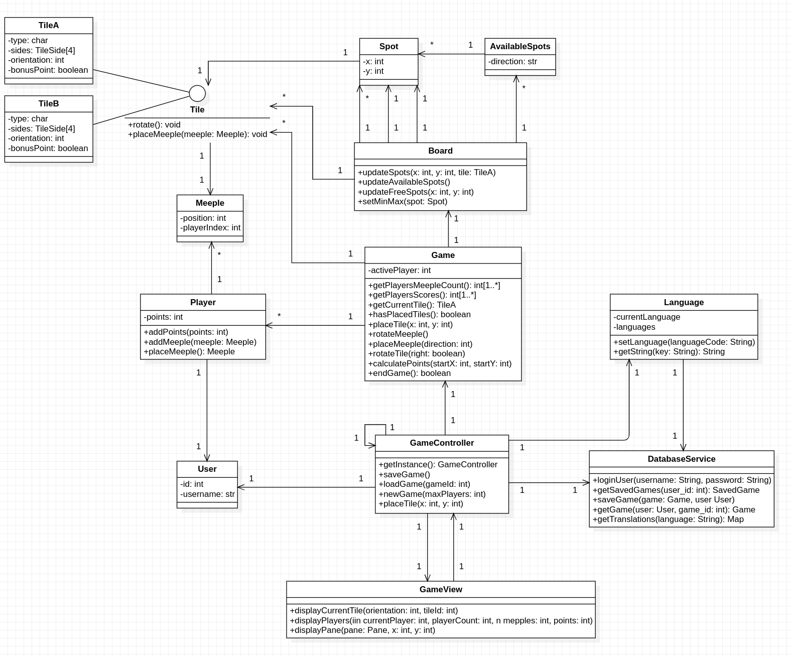

# Software Architecture
## Class diagram
!
Project name: Carcassonne
General game explanation: Carcassonne is a multiplayer board game. It is composed of tiles that you place during
the game and meeples that increase the points awarded after you complete affiliated
task.
**Detailed diagram explanation:**
- **User:**
The user is the entity stored in the database that represents the player that
interacts with the app.
- **Player:**
The player is the entity that plays the game. A same user can play multiple
players at the same time.
The player has points acquired during the game and a set of meeples that he can
play following Carcassonne rules.
- **Meeple:**
The meeple is the little piece from the game associated to a player. It acts as a
multiplier of points on the tile it is placed.
- **Tile:**
The tile is the square piece that is used to create the board. When placed, the
player can choose to add a meeple to it and change its orientation.
- **Spot:**
The spot is an entity to represent where a tile can be place on the board.
- **AvailableSpots:**
It is used to store the possible spots where the current tile can be played.
- **Board:**
The board is the main entity that stores all the game related entities.
It allows access to the board itself where all the placed tiles are stored
It also stores the available spots of the current tile to be played.
- **Game:**
The game is the entity that allows all the interactions of the game.
It stores the board and the players.
Each turn, the game lets the current player place a tile with the possibility of
placing a meeple on it. Then calculates the points and updates them. Finally, it
switches to the next player, and the same steps are done until the game ends.
- **GameController:**
The game controller acts as the menu for the game. It gives the option of starting
a new game, save a current game and access the saved games to continue
playing.
## Package diagram
