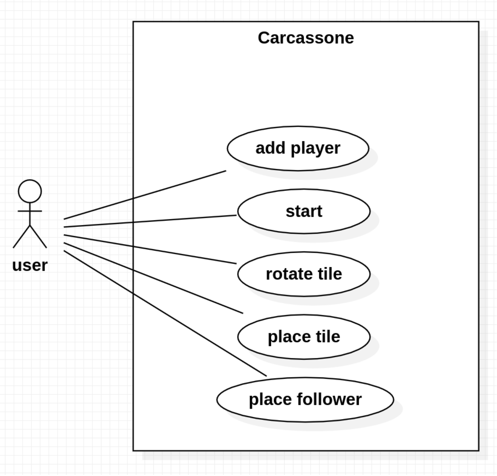

# Use cases

**User:** Main menu user. When the game starts it changes to player 1, 2, 3, 4 or 5 during their
turn.

**Add player:** The default and minimum number of players is 2 and the maximum is 5. The
user can add players on the main menu before the game starts.

**Start game:** Start the game and show a map with the first tile at the center of the map.
Show player 1 turn.

**Place Tile:** The user selects the placement of the current tile on the grid adjacent to the
existing tiles. Checks compatibility with adjacent tile before indicating valid placement.
Move tiles along the faces of other tiles already on the map. Place tile, if all faces
connected to adjacent tiles are of the same type.

**Rotate Tile:** Rotate the current placing tile.

**Place Follower:** Place a follower on eligible region within the placed tile or skip placing a
follower. Eligible regions are regions without followers.

**Tile face type:** There are 4 types: river, city, road, and field.
Regions: There are 4 regions: cities, roads, fields, and monasteries.
