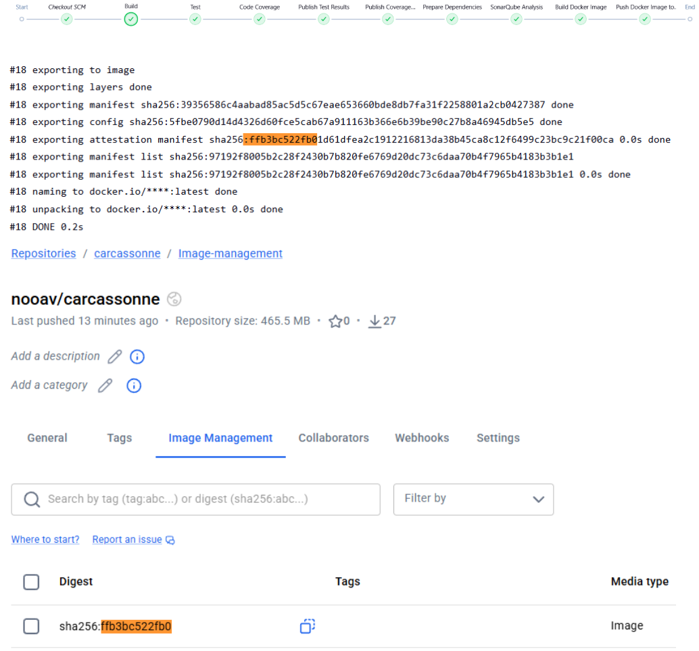

## Sprint 7 Review Report

### Jenkins Pipeline

### Test coverage
Added more tests for tests coverage and a Acceptance test document.

### Security issues
Fixed the security issues displayed in Sonar Qube.

### Next Sprint Focus

### Table of time spent by each member during the sprint

| Member  | Time Spent(in hours) | Task(s)                                                | In-class task |
|:-------:|:--------------------:|:-------------------------------------------------------|:-------------:|
| Juan    |                      |  |   Submited    |
| Noah    |                      |     |   Submited    |
| Nooa    |          8           |   |   Submited    |
| Raphael |                      |   |   Submited    |
