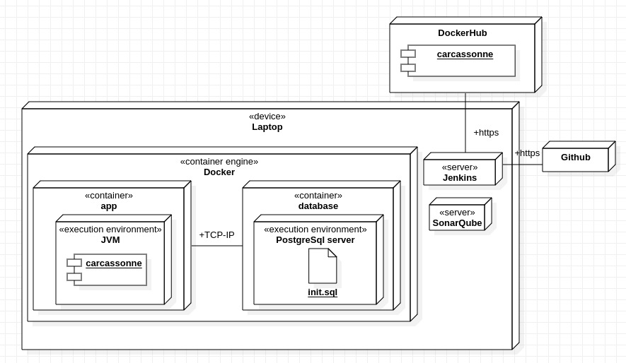

# Carcasonne
Software version of the game Carcasonne.

## 1. Brief Summary
This project was carried out by the four (4) contributors as part of the Software Engineering Project 1 and 2 course.  
We have used Agile methodology throughout the development of the app.  
During it, the work was separated into eight (8) sprints of two (2) weeks each where we created a state-of-the-art replica of the board game Carcassonne.  
The project can be fully run on docker as it was an objetive of the course.  
<a id="professor"></a>Professor : [Amir Dirin](https://github.com/ADirin).  
<a id="contributors"></a>Contributors : 
[Juan-Valen](https://github.com/Juan-Valen), 
[NooA-V](https://github.com/NooaV-M), 
[Haon19](https://github.com/Haon19), 
[RForSwan](https://github.com/RForSwan).

## 2. Technology Stack
The project relies on the listed technologies to run :
* Code :
  * Java
  * JavaFX
* Database :
  * PostgreSQL
* DevOps methods :
  * Github
  * Jenkins
  * Docker
  * SonarQube
  * Kubernetes (W.I.P.)
### Development deployment diagram


This deployment diagram shows how the technologies are used during development.

## 3. Database Diagrams
This database diagrams show how the user data, saved games and translations are stored.
The two (2) main parts in the [database diagram](./Documents/diagram/database-design.md) are the localization on top and the saved games at the bottom of each diagram.

## 4. Software architecture
The following software architecture uses an MVC model with Services as it is further explained in the [software architecture document](./Documents/diagram/software_architecture.md) and seen in the class diagram bellow.


The Class diagram can be described as follows,  
The user interacts with the game.  
The user can connect to the game.  
The user, once connected, can start a game, play using the different functionalities and save it.  
The game, by the action of the player, can interact with the virtual tiles (turn and place them).  
The game can also interact with the database by saving or retrieving past or current games.  

## 5. Instruction for playing the game with docker.

### Run the app using docker compose
```bash
docker compose up --build -d
```
**Disclaimer :** Please ensure that you have the proper tools installed and running


### [DEPRECATED]

### Run database for game with docker
First, follow the [database instructions](./database-instructions.md). Note: to run the instructions you will need to copy the [sql initialization file](./config/init.sql).

### Run the game with docker
For linux run:
```bash
docker run --name carcassonne_app \
  -e DISPLAY=$DISPLAY \
  -v /tmp/.X11-unix:/tmp/.X11-unix \
  juanvalenzuela101/carcassonne_v1_2026
```

For Windows/Mac run:
```bash
docker run --name carcassonne_app -e DISPLAY=host.docker.internal:0 -v /tmp/.X11-unix:/tmp/.X11-unix juanvalenzuela101/carcassonne_v1_2026
```

## 6. Localization
You can adapt the UI using localization.  
When launching the game, select the box at the bottom and choose the desired language.  
Languages implemented :
* English
* Russian
* Chinese

The app uses a database translation table that is initialized along with other database tables in the [sql initialization file](./config/init.sql).

The script creates the table and inserts all the translations (containing a language ID, an english key and the given languages translation)

## 7. Quality assurance
The project is set up with Jenkins and SonarQube for continuous integration and code quality analysis.  
The Jenkins pipeline is defined in the [Jenkinsfile](./carcassonne/Jenkinsfile)
The setup guide for the Jenkins pipeline can be found in the [Jenkins setup instructions](./Jenkins-setup.md)  
We also did [acceptance test and results](./Documents/code_review/acceptance_test_plan.md).

## 8. Sprints Details
Here is a quick look around of the eight (8) sprints
* #### Sprint 1 : [*Project Planning & Vision*](./Documents/sprint/Sprint_1_Review_Report.md)  
* #### Sprint 2 : [*Requirements & Database*](./Documents/sprint/Sprint_2_Review_Report.md)  
* #### Sprint 3 : [*UI Implementation & CI*](./Documents/sprint/Sprint_3_Review_Report.md)  
* #### Sprint 4 : [*Docker Containerization*](./Documents/sprint/Sprint_4_Review_Report.md)  
* #### Sprint 5 : [*UI Localization & Kubernetes*](./Documents/sprint/Sprint_5_Review_Report.md)  
* #### Sprint 6 : [*Database Localization*](./Documents/sprint/Sprint_6_Review_Report.md)  
* #### Sprint 7 : [*Quality Assurance*](./Documents/sprint/Sprint_7_Review_Report.md)  
* #### Sprint 8 : [*Documentation & Finalization*](./Documents/sprint/Sprint_8_Review_Report.md)  

## 9. Acknowledgments
> Thank you to all the [contributors](#contributors) and [teacher](#professor)
